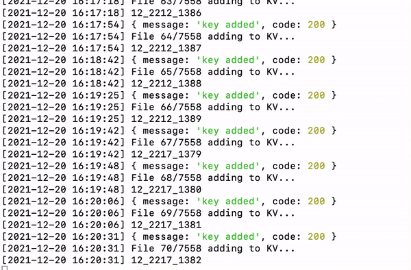

# Galileo

Galileo is a stack of technologies designed for uploading and displaying map data using decentralized storage. It aims to offer a secure, efficient, and flexible way to handle geographical information.

## Technical Details

### Storage
Map tiles of specific countries are uploaded to Swarm using [FairOS-dfs](https://github.com/fairDataSociety/fairOS-dfs) or [FDP Storage](https://github.com/fairDataSociety/fdp-storage).

### Indexing
The uploaded map tiles are indexed in such a way that they can be easily accessed and displayed either via a web interface or a user's local node.

### UI
The User Interface for displaying these maps is written using React.

## Features

- **Decentralized**: By using Swarm and FairOS-dfs, Galileo ensures that the data is stored in a decentralized manner.
- **Public Sharing**: Maps can be shared publicly, allowing for collaborative use and updating.
- **Selective Display**: Despite the global scale of the map data, users can choose to display only specific countries or cities.
- **Trusted Providers**: Users can combine sets of tiles from trusted providers to create comprehensive maps that cover the entire world.

## Why Galileo?

The reason for using map data from trusted providers is to display geographical information in a manner that is mutually acceptable for both the user and the sharing party.

### How to create and share your own map?

Prerequisites:
- access to a [fairos-dfs](https://github.com/fairDataSociety/fairOS-dfs) server endpoint
- account on https://developers.nextzen.org/
- python3
- nodejs

You can run your own fairos-dfs endpoint, but setting this up is outside of the scope of this readme. Alternativaly, join the [Fair Data Society Discord](https://discord.gg/KrVTmahcUA) and use the #liberate-data-directory channel to gain more information, support and apply for access to fairos-dfs server endpoints.

You can find information on how to install nodejs in https://github.com/nodesource/distributions/blob/master/README.md

The process to create and share a map:

1) Download GeoJSON files of specific region with script:
   https://gist.github.com/IgorShadurin/afdc91d2f21cc8154e24da02d1805813.

   Find `YOUR_ACCESS_TOKEN` and replace with your key from https://developers.nextzen.org/keys.
   Start downloading process by running
   ```python3 osm_tiles_downloader.py 46.06902628310932 14.507817723324576```.

   The last two parameters are coordinates of the region you want to download.

2) Copy `/scripts/example.env` to `/scripts/.env`

3) Edit the `.env` file to define parameters:
    1) `FAIROS_URL` - FairOS API url, for example `http://localhost:9090/v1/`
       or `https://fairos-mainnet.fairdatasociety.org/v1/` for a FairOS mainnet endpoint.
    2) `FAIROS_USERNAME` - FairOS username. If users doesn't exist - it will be created.
    3) `FAIROS_PASSWORD` - FairOS password for user.
    4) `FAIROS_POD` - pod name. Exists or not. If you want to share the map, then use a name that should be unique.
    5) `FAIROS_MAP_KV` - key-value name of the stored map data.
    6) `MAP_PATH` - full path to folder with tile files which downloaded above.

4) Go to `scripts` folder, run `cd scripts`, run `npm i` or `yarn`.

5) Run upload script `node upload-map-kv.js`. **Important notice**: each map should be uploaded into a separate pod. This is necessary for the convenient compilation of the register of maps.

   Note that sometimes you need to pause a process to continue later. To continue uploading you can use the command `node upload-map-kv.js retry 78`, where 78 is number of position where you want to proceed. Uploading ~ 700 megabytes might take about 7 hours.

   

6) Wait for the script to upload all data and return Map reference (a hash). You can share you map reference with the community.

   Join the [Fair Data Society Discord](https://discord.gg/KrVTmahcUA) and use the #liberate-data-directory channel to share your map reference, add it to the Liberate Data Directory and have it displayed on Galileo maps.

### Other

#### Tile files examples

Switzerland: https://old.testeron.pro/osm/tiles_sw.zip

Czech Republic: https://old.testeron.pro/osm/tiles_cz.zip

#### Links

Download tiles script: https://gist.github.com/IgorShadurin/afdc91d2f21cc8154e24da02d1805813

Make tiles info: https://github.com/tilezen/vector-datasource/wiki/Mapzen-Vector-Tile-Service

#### Run Galileo from scratch (manual & Docker), "How to create maps registry?"

You might want to run your own registry of maps & server. This is a more advanced topic which is covered in:

https://github.com/fairDataSociety/galileo/blob/master/instructions/Installation.md
